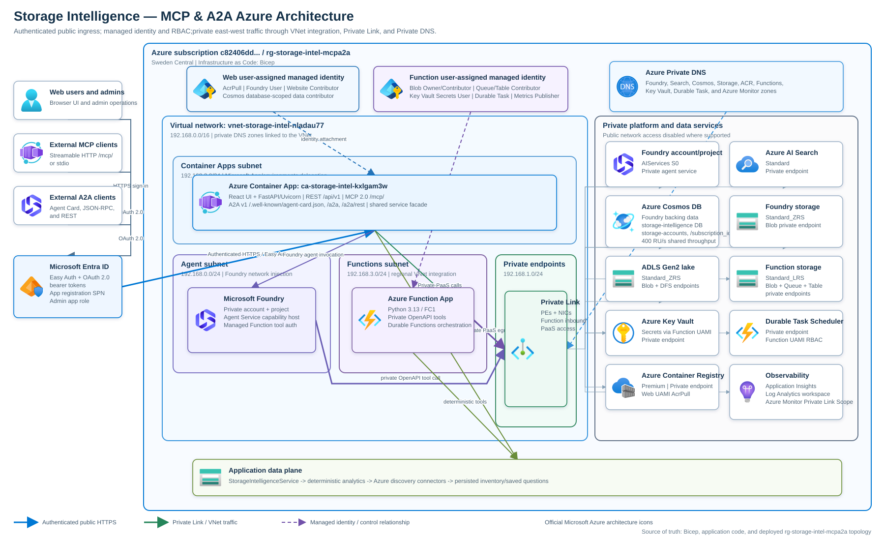

# Storage Intelligence MCP/A2A Agent

Production-like, read-only Azure storage intelligence pilot with a 2,500-account
synthetic estate spanning 339 subscriptions across Dev, QA, Perf, and Prod, deterministic
analytics, private Foundry tools, and an Entra-protected web application.



Open the [editable Visio diagram](docs/architecture/storage-intelligence-architecture.vsdx),
the [diagrams.net source](docs/architecture/storage-intelligence-architecture.drawio), or the
[detailed architecture guide](docs/ARCHITECTURE.md).

The same deterministic agent is available through REST, an official MCP
Streamable HTTP server, and A2A v1 JSON-RPC/HTTP+JSON endpoints. See
[MCP and A2A integration](docs/PROTOCOL_INTEGRATION.md) for client configuration,
authentication, discovery, and request examples.

## Live MCP and A2A endpoints

The Sweden Central deployment uses this Entra-protected base URL:

`https://ca-storage-intel-kxlgam3w.wittyforest-55ec85c1.swedencentral.azurecontainerapps.io`

| Protocol | Endpoint |
|---|---|
| MCP Streamable HTTP | `https://ca-storage-intel-kxlgam3w.wittyforest-55ec85c1.swedencentral.azurecontainerapps.io/mcp/` |
| A2A Agent Card | `https://ca-storage-intel-kxlgam3w.wittyforest-55ec85c1.swedencentral.azurecontainerapps.io/.well-known/agent-card.json` |
| A2A JSON-RPC | `https://ca-storage-intel-kxlgam3w.wittyforest-55ec85c1.swedencentral.azurecontainerapps.io/a2a` |
| A2A HTTP+JSON | `https://ca-storage-intel-kxlgam3w.wittyforest-55ec85c1.swedencentral.azurecontainerapps.io/a2a/rest` |

External clients must request a Microsoft Entra token for the web application's
`api://<WEB_AUTH_CLIENT_ID>` audience and send it as a bearer token. Use `/mcp/`
as the canonical MCP URL; `/mcp` redirects to the mounted transport path.

## Product experience

- PepsiCo-branded responsive dashboard with pinned, locally served React assets.
- Persistent English/Spanish language switch in the top-right header for globally
  distributed teams in Hyderabad, Barcelona, Mexico, the US, and the UK. Navigation,
  forms, statuses, accessibility labels, dynamic counts, risk factors, built-in questions,
  and deterministic answer summaries render in the selected language without changing
  API identifiers or resource names.
- Manual pilot onboarding by storage account name, tenant ID, management group,
  subscription, environment, subsidiary/business unit, region, and access tier.
- Authenticated selection-list management for adding tenants, management groups,
  subscriptions, subsidiaries/business units,
  plus the complete customer-facing Azure public-region catalog in every region selector.
- Bulk XLSX/CSV onboarding for avoiding repetitive manual entry. Imports are validated
  as a complete workbook, reject duplicates, preserve the AIRGAP template's storage-account
  attributes, and upsert them to private Cosmos DB before updating the in-memory inventory.
- Account rows in Overview, Agent Investigation, Savings Simulator, Findings, and Data
  Health include accessible checkboxes plus a tile-level **Notify project owners** action.
  The action remains disabled until that tile has a selection and batches up to 100
  selected accounts into one actionable Azure Communication Services email. The pilot
  recipient is fixed server-side to `nrp@microsoft.com`.
- Administrator-only tenant discovery that runs read-only Azure CLI commands across all
  authorized subscriptions and imports tenant, management-group, subsidiary/business-unit,
  environment, storage account, region, tier, SKU, access/network posture, and
  project-governance tags.
- Tiny Databricks, Fabric Lakehouse, SAP, Azure Data Factory, SFTP, and Application
  Insights badges on linked storage accounts. The synthetic estate deterministically
  randomizes these relationships; discovery reads native `isSftpEnabled`/`isHnsEnabled`
  properties plus `ApplicationInsights`/`AppInsights` tag aliases.
- Deterministic capacity, cost, risk, Databricks, forecast, anomaly, tier-savings,
  evidence, confidence, and freshness investigations.
- Risk concentration lists Growth, Cost, Freshness, Operations, Databricks, Configuration,
  Security, and Governance categories with a calm low-saturation palette. Security
  explicitly scores SAS/shared keys, public access, missing private endpoints, NSG/ASG
  links, and missing service-principal access. Governance uses project, business-unit,
  last-accessed, and defunct tags. A donut-style pie chart summarizes the
  dominant-risk distribution, while every scoped account scoring at least 20 remains in
  the ranked, vertically scrollable list. Hovering a pie segment displays the risk
  description, account count, and percentage; keyboard focus shows the largest segment.
- **Actionable Data Health posture tiles:** **Stale accounts**, **Missing lifecycle**,
  **SAS Key**, **Public Access**, **No Private Endpoint**,
  **No Service Principal**, **No GRS/GZRS**, **NSG/ASG linked**, and **Defunct Projects**
  plus **SFTP Enabled** and **AppInsights Data** are buttons. Selecting one immediately
  loads every matching account for the active scope into a risk-sorted, vertically
  scrollable panel directly below the tiles on the Data Health page. Overview remains
  focused on estate capacity, cost, savings, risk concentration, and onboarding. The
  former standalone stale-account details panel is removed because Stale accounts now uses
  this common drilldown.
- Priority findings explains the Growth and Operations component scores. Operations is
  the 0–100 throttling/latency subscore; the right-side value is the overall weighted
  account risk score out of 100.

Manual and spreadsheet onboarding never create or change Azure Storage resources.

The Container Apps web workload uses one always-ready Consumption replica with
1 vCPU and 2 GiB memory. This keeps A2A task lookup and cancellation consistent with
the SDK's process-local task handler. Ingress targets port `8000`, matching Uvicorn and
the Dockerfile, and probes allow 10 seconds for transient load. Private Function deployment
and Foundry smoke tests are intentionally decoupled from web startup so the public
Entra-protected UI cannot be blocked by a private dependency. Application version
`0.1.0` remains unchanged.

## Functional views

- **Agent Investigation** runs scoped deterministic tools, displays the full trust
  envelope and structured result, explains why every returned account was flagged, keeps
  evidence citations aligned with all unique returned accounts, offers a broad reusable
  catalog of operational/financial/platform questions, saves new authenticated questions
  for future sessions, and retains the latest eight investigations in-session.
- **Savings Simulator** models 1-100% tiering adoption, compares 10/25/50% baselines,
  ranks the top 20 candidates, and retains retrieval/retention caveats.
- **Findings** combines risk, robust growth anomalies, data freshness, and savings actions
  into a severity-sorted inbox. **Total Findings**, **Data Freshness**, **Growth Anomaly**,
  **Risk**, and **Savings Action** are clickable summary tiles; selecting one immediately
  filters the scrollable results panel below. The former duplicate filter-button row is
  removed.
- **Data Health** shows freshness coverage, connector/source status, lifecycle and assumed
  tier gaps, and a scrollable stale-account remediation list. For administrators, the
  visible **Disabled** status is a button: clicking it enables that connector, changes the
  status to **Enabled**, and reveals a clickable **Run** action. A completed pilot-fixture
  run changes the status to **Healthy** and shows synced/eligible counts and last-run time.
  Security posture cards expose SAS/shared keys, public access, missing private endpoints,
  missing service-principal access, non-GRS/GZRS replication, NSG/ASG links, defunct
  projects, missing last-access tags, SFTP-enabled endpoints, and Application
  Insights-linked storage.
- Data Health places **Synthetic pilot**, **Azure CLI discovery**, **Azure Resource Graph**,
  **Blob Inventory**, **Azure Monitor Metrics**, **Cost Management exports**, and
  **Databricks system tables** immediately after the global filters/reset row.

## Tenant-wide admin discovery

Administrators see a dedicated **Admin** item in the left navigation. Its
**Pull Tenant Wide Storage Account Details** action uses Azure CLI argument arrays (never
a shell command string) to enumerate every enabled subscription visible to the
authenticated identity and run `az storage account list` for each subscription. Results
are ingested idempotently into the pilot inventory and upserted into the private Cosmos DB
`storage-intelligence/storage-accounts` container.

Configure the runtime with:

| Variable | Purpose | Default |
|---|---|---|
| `ADMIN_ROLE` | Entra app role required by admin endpoints | `StorageIntelligence.Admin` |
| `DISCOVERY_TENANT_IDS` | Optional comma-separated tenant IDs; empty means every tenant visible in the CLI account cache | empty |
| `DISCOVERY_USE_MANAGED_IDENTITY` | Run `az login --identity` with `AZURE_CLIENT_ID` | `true` |
| `DISCOVERY_CRON` | Initial five-field discovery schedule | `0 */6 * * *` |
| `DISCOVERY_SCHEDULE_PATH` | Persisted admin schedule configuration | `data/discovery-schedule.json` |
| `DISCOVERY_OUTPUT_PATH` | Scheduled CLI snapshot path | `data/discovered-storage-accounts.json` |
| `AZURE_CLI_PATH` | Azure CLI executable | `az` |
| `COSMOS_INVENTORY_ENABLED` | Persist spreadsheet imports and scheduled discovery results to Cosmos DB | `false` locally; `true` in Azure |
| `COSMOS_ENDPOINT` | Private Cosmos DB account endpoint | required when persistence is enabled |
| `COSMOS_DATABASE` | Inventory database name | `storage-intelligence` |
| `COSMOS_CONTAINER` | Storage-account container name | `storage-accounts` |
| `SAVED_QUESTIONS_PATH` | Atomic localhost question-library file when Cosmos is disabled | `data/saved-agent-questions.json` |
| `AZURE_COMMUNICATION_EMAIL_ENDPOINT` | Azure Communication Services endpoint used with managed identity | required for notifications |
| `AZURE_COMMUNICATION_EMAIL_SENDER` | Verified Azure-managed `DoNotReply` sender address | required for notifications |
| `PROJECT_OWNER_NOTIFICATION_RECIPIENT` | Server-controlled pilot recipient; never accepted from the browser | `nrp@microsoft.com` in Azure |

The managed identity or automation principal must be granted read-only access in every
target subscription/tenant. This project deliberately does not assign tenant-wide
`Reader` roles. Cross-tenant discovery works only after the identity is explicitly
authorized in each tenant.

Run discovery directly:

```powershell
.\scripts\run-storage-discovery.ps1
```

Administrators can edit the five-field cron expression directly in the dashboard. The
schedule is validated with `croniter`, persisted atomically, and used by the in-process
scheduler after restart. The next execution time and common UTC cron examples are shown
in the role-gated Admin view. Provisioning creates the `StorageIntelligence.Admin` Entra
app role and assigns it to the deploying user. Each completed pull reports the number of
Cosmos DB upserts. Cosmos uses the web app's managed identity, a database-scoped built-in
Data Contributor assignment, `/subscription_id` partitioning, and no account keys.

For an external automation host, install the supplied six-hour fallback cron:

```bash
crontab config/storage-discovery.cron
```

The external scheduled command writes an atomic JSON snapshot. The in-app scheduler
upserts the same account details to Cosmos DB. Neither path requests storage keys or
mutates estate resources.

Discovery recognizes Databricks, Fabric Lakehouse, SAP, Azure Data Factory, and
Application Insights tag aliases plus native SFTP/HNS state.
It also reads `Project`/`ProjectName`, `BusinessUnit`, `LastAccessedDate`,
`ProjectStatus`/`ProjectDefunct`, `UsesSASKeys`, `ServicePrincipalAccess`,
`NetworkSecurityGroup`/`NSG`, and `ApplicationSecurityGroup`/`ASG`. Azure resource
properties supply shared-key access, public network/blob access, private endpoint state,
and replication SKU. Linked accounts appear in a dedicated dashboard section with compact
accessible badges.

The navigation footer displays `© 2026 PepsiCo. All rights reserved.` followed by tiny,
accessible Microsoft, Azure, and the supplied Azure AI Foundry image mark. The Foundry PNG
is committed under `src/web/static/assets` with a SHA-256 manifest.

### Spreadsheet format

Upload an `.xlsx` workbook or UTF-8 `.csv` file with a header row and these columns:

| Column | Example |
|---|---|
| `name` | `stfinancearchive01` |
| `tenant_id` | `11111111-1111-4111-8111-111111111111` |
| `management_group` | `mg-americas-platform` |
| `subscription` | `platform-prod` |
| `environment` | `Prod` |
| `subsidiary` | `PepsiCo Beverages North America` |
| `region` | `eastus2` |
| `tier` | `Cool` |

The importer accepts up to 10,000 rows or 5 MB per file. Friendly header aliases such
as `storage_account_name`, `tenant`, `managementgroup`, `subscription_name`,
`environment`/`stage`/`env`, `Business unit`, `azure_region`, and `access_tier` are
normalized automatically.
`business_unit` is a compatibility alias for `subsidiary`. Every hierarchy value must
exist in the pilot catalog; known synthetic subscriptions are validated against their
tenant, management group, environment, and subsidiary. Regions may use any code from the complete
Azure public-region selector; tiers must use an available access tier.

The versioned synthetic catalog contains exactly 339 subscriptions. Each subscription has
a deterministic UUID, tenant, management group, subsidiary, and one of `Dev`, `QA`,
`Perf`, or `Prod`. All 339 names appear in the global subscription selector.

### Investigation question library

`GET /api/questions` returns the built-in and saved question catalog.
`POST /api/questions` accepts a new 3-500 character question, normalizes whitespace,
rejects case-insensitive duplicates, and caps the shared library at 100 custom questions.
Azure stores custom questions as `saved-agent-question` documents in the existing private
Cosmos container under the `__agent_questions__` partition. Localhost uses the atomic JSON
path above. Saving a question does not execute it or mutate an Azure resource.

## Local run

Python 3.13 is required. Node.js and npm are not used.

```powershell
python -m venv .venv
.\.venv\Scripts\python -m pip install -e ".[test]"
$env:AUTH_DISABLED = "true"
.\.venv\Scripts\python -m uvicorn web.app:app --host 127.0.0.1 --port 8000
```

Open `http://127.0.0.1:8000`. Run acceptance tests with:

```powershell
.\.venv\Scripts\python -m pytest
```

The language preference is stored in browser `localStorage` under
`storage-intelligence-language`. English (`en`) is the default; Spanish (`es`) updates the
document language and title. Built-in Spanish questions are canonicalized back to their
English deterministic intent before API submission, while the backend also recognizes
common Spanish intent phrases for newly authored questions.

## Architecture

- `src/storage_intelligence`: synthetic generator, connectors, analytics, query router.
- `src/protocols/service.py`: protocol-neutral read-only agent facade.
- `src/protocols/mcp_server.py`: MCP tools, resource, prompt, HTTP mount, and stdio entry point.
- `src/protocols/a2a_server.py`: A2A Agent Card, JSON-RPC/REST routes, task executor, and artifacts.
- `src/protocols/README.md`: code-adjacent MCP/A2A endpoint, authentication, and usage reference.
- `src/web`: FastAPI, managed-identity ACS email notifications, and vendored React 18.3.1 browser UI.
- `src/function_app.py`: private OpenAPI tools and durable fan-out/fan-in collection.
- `src/agent`: Foundry instructions, OpenAPI contract, deploy/invoke scripts, and evals.
- `infra/foundry`: official template 19 baseline and unmodified supporting modules.
- `infra/functions-base`: preserved official Flex Consumption base modules.
- `infra`: composed workload Bicep and AZD parameters.

See [product specification](docs/PRODUCT_SPEC.md),
[architecture](docs/ARCHITECTURE.md), and
[protocol integration](docs/PROTOCOL_INTEGRATION.md). The synchronized
[Visio, diagrams.net, and SVG architecture assets](docs/architecture/README.md)
show the deployed UI-to-database topology, protocol endpoints, trust boundaries,
managed identities, RBAC, VNet subnets, Private Link paths, and monitoring plane.

## Azure workflow

The approved `.azure/deployment-plan.md` is the source of truth. Deployment uses:

```powershell
azd env new storage-intel-pilot
azd env set AZURE_LOCATION swedencentral
azd env set AZURE_SUBSCRIPTION_ID c82406dd-f84c-42df-9586-c6f02abda6df
azd provision --preview --no-prompt
azd provision --no-prompt
azd deploy --no-prompt
```

The deployment scripts create or reuse secretless Entra application registrations,
enable ID-token issuance for Container Apps Easy Auth, deploy the web image and Functions
package, then create the Foundry prompt-agent version. Easy Auth accepts both the
application client ID and its `api://` identifier URI as token audiences.
Production connectors remain disabled unless their explicit flags and least-privilege
roles are configured. The workload also provisions Azure Communication Services, Email
Communication Service, and an Azure-managed Europe domain. The web UAMI uses
`DefaultAzureCredential`; no email connection string or key is stored. Because ACS does
not expose a send-only managed-identity role, the required Communication and Email Service
Owner assignment is constrained to that single Communication Services resource.

## Cost caveats

Private Foundry Standard requires fixed-cost AI Search Standard and Premium ACR. Cosmos DB,
monitoring ingestion, model tokens, private endpoints, and Container Apps add usage-based
costs. Azure Communication Services Email adds pay-as-you-go message charges. The pilot
avoids estate API and Databricks query charges by using synthetic data.
