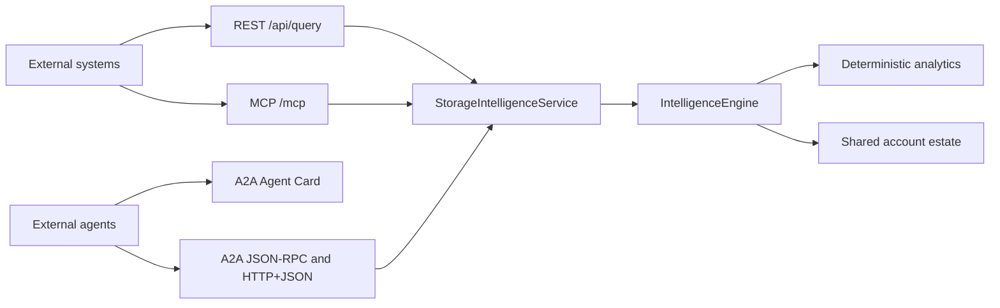
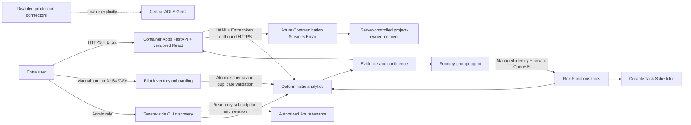

# Storage Intelligence Agent Architecture

## Architecture diagram

The [native Visio source](architecture/storage-intelligence-architecture.vsdx) and
[diagrams.net source](architecture/storage-intelligence-architecture.drawio) are editable.
See the [diagram guide](architecture/README.md) for format and regeneration details.

## Protocol-first agent boundary

`StorageIntelligenceService` is the single protocol-neutral facade over the
deterministic `IntelligenceEngine`. The existing REST API, MCP adapter, and A2A
executor operate on the same account collection and preserve identical trust
envelopes.

MCP is stateless at the HTTP transport layer for safe horizontal scaling. A2A
uses an in-memory task store and streams task events from submitted through
working to completed or failed. The A2A result artifact includes both a concise
text part and the complete structured result.

Protocol endpoints are hosted by the existing FastAPI/Uvicorn process and inherit
Container Apps Easy Auth. MCP additionally validates Host and Origin headers
against explicit runtime allowlists.

## Runtime flow

## Azure topology

Official `microsoft-foundry/foundry-samples` template
`19-private-network-agent-tools` remains the baseline for Foundry account/project,
capability hosts, VNet injection, Search, Cosmos DB, Foundry storage, private DNS,
private endpoints, Premium ACR, and tracing. The composed workload adds:

- externally reachable Container Apps web ingress protected by Microsoft Entra;
- one always-ready Container Apps replica using the supported 1 vCPU/2 GiB
  Consumption pairing, preserving process-local A2A task and cancellation state,
  with external HTTPS ingress and target port `8000`;
- Python 3.13 Flex Consumption Functions with UAMI, private endpoint, and VNet integration;
- Durable Task Scheduler Consumption with public access disabled and a private endpoint;
- central ZRS ADLS Gen2 with blob/dfs private endpoints;
- a dedicated Cosmos DB inventory database/container with 400 RU/s shared throughput and
  `/subscription_id` partitioning;
- Function deployment storage with shared-key access disabled;
- Key Vault RBAC mode and private endpoint.
- Azure Communication Services plus Email Communication Service in the Europe data
  geography, linked to an Azure-managed domain for outbound project-owner notifications.

The agent, data services, tools, registry, scheduler, and secrets remain private. DNS
zones are linked to the single workload VNet. Capability-host networking is not
reimplemented outside template 19.

Web startup does not deploy or smoke-test the private Function/agent. Those operations are
separate deployment activities, preventing private dependency failures from blocking the
public Entra-authenticated UI. Uvicorn, Docker `EXPOSE`, health probes, and Container Apps
ingress all use port `8000`; users browse the HTTPS FQDN without appending a port. Startup,
liveness, and readiness probes allow a 10-second response window to avoid false failures
during brief CPU or network contention.

## Identity and authorization

- The web and Function tool audiences use dedicated Entra applications.
- Foundry calls the private OpenAPI tool with `OpenApiManagedAuthDetails`.
- Functions use a UAMI for storage, ADLS, DTS, Key Vault, and monitoring.
- The web UAMI receives Cosmos DB Built-in Data Contributor scoped only to the
  `storage-intelligence` database.
- The web UAMI uses `DefaultAzureCredential` for ACS Email. Azure currently has no
  send-only managed-identity role, so the required Communication and Email Service Owner
  role is constrained to the single Communication Services resource. Local/key
  authentication is disabled.
- Foundry project system identity receives only the official template's required data roles.
- Shared storage keys, ACR admin, Cosmos local auth, Search local auth, and public data-plane
  access are disabled.

## Data model and scale

Raw, normalized, curated, and findings zones are partitioned by
source/date/tenant/management-group/subsidiary/subscription/environment/account.
The synthetic pilot remains materialized in memory for deterministic analytics. Azure CLI
discovery and AIRGAP spreadsheet imports hash each resource ID into a Cosmos-safe document
ID and upsert the complete account record into `storage-intelligence/storage-accounts`,
partitioned by subscription ID. Discovery and spreadsheet imports use the same idempotent
managed-identity persistence path with distinct source metadata; an enabled Cosmos failure
fails the operation instead of silently reporting success.
Production connectors return the same account-shaped records and use bounded batch sizes
(50 metrics resources; 250-account durable partitions), watermarks, and idempotency keys.

## Analytics

- robust growth anomaly score using median absolute deviation;
- transparent weighted risk dimensions;
- explicit Security posture from SAS/shared keys, public network/blob access, private
  endpoint state, NSG/ASG links, and service-principal access;
- Governance posture from project/business-unit/last-accessed/defunct tags, plus
  resilience exposure when GRS/GZRS is absent;
- deterministic cost decomposition;
- tier savings net retrieval and operation charges;
- Databricks impact from IO, small files, latency, and throttling;
- bounded compound trend forecasts with explicit ranges;
- freshness scoring from source timestamps.

The Operations component is a normalized 0–100 subscore combining throttling percentage
and request latency above the 40 ms baseline. Priority findings shows that component next
to Growth, while the far-right `/100` value is the weighted overall risk score across all
six dimensions.

The portfolio projection computes all risk scores once, returns every scoped account at
or above the score-20 at-risk threshold in descending order, and leaves viewport
constraining to the client-side scroll container. The browser derives a six-segment
dominant-risk distribution and renders it as a CSS `conic-gradient` donut without adding
a chart dependency. Pointer coordinates are converted to a clockwise segment angle so
the matching description/count/percentage can update an accessible live region; keyboard
focus selects the largest segment. Priority findings remain bounded to the top eight so
the views serve different purposes.

## Threat boundaries

No tool accepts SQL, KQL, executable code, ARM payloads, or mutation verbs. API filters
are allowlisted. Connector execution requires two independent enablement controls.
Application logs exclude credentials and response evidence contains resource IDs only.

Pilot inventory onboarding is an authenticated application-local write, not an Azure
estate mutation. Manual and spreadsheet routes share the same account schema and current
portfolio selection catalog. Spreadsheet bytes are capped before parsing; all rows,
headers, choices, names, and duplicates are validated before any in-memory records are
added. Validated spreadsheet records are upserted to private Cosmos DB before in-memory
publication, and persistence failures return an explicit error without mutating the
in-memory pilot.

Subscription, business-unit, and tracked-region catalogs are also application-local and
protected by the same Entra boundary. Region validation uses a versioned list of all
customer-facing Azure public cloud physical regions (excluding internal STG/EUAP and
sovereign-cloud locations). Adding catalog values never calls Azure Resource Manager.

Tenant-wide discovery is separately protected by the `StorageIntelligence.Admin` Entra
app role. The runner invokes Azure CLI with fixed argument arrays and explicit
`--subscription` values; it never accepts arbitrary command text, requests account keys,
or performs writes. Managed identity login is used in Azure, and each tenant/subscription
must grant read-only RBAC explicitly. The web task upserts discovery records into private
Cosmos DB through managed identity before updating the in-memory pilot. The six-hour
external cron entry writes a temporary file and atomically renames it to the configured
JSON snapshot path.

The normalized hierarchy is
`tenant_id → management_group → subsidiary → subscription → storage account`, with every
subscription carrying an environment classification of Dev, QA, Perf, or Prod.
`business_unit` remains a compatibility alias for `subsidiary`. The deterministic fixture
contains three synthetic PepsiCo tenants, four management groups, five subsidiaries, and
339 mapped subscriptions. Azure CLI discovery reads management-group membership and
environment tags/name conventions when
authorized and otherwise surfaces a warning while retaining explicit tag or `Unassigned`
metadata. All API scopes report counts for each hierarchy level and environment.

The web process also runs a lightweight cron matcher. Administrators update a five-field
expression through a role-gated API; the value is validated, atomically persisted under
the writable data directory, and reloaded at startup. A matching minute starts the same
idempotent discovery task only when another run is not active.

Discovery maps optional `DatabricksWorkspace`/`Databricks`,
`FabricLakehouse`/`Lakehouse`, `SAPSystem`/`SAPWorkload`/`SAP`, and
`AzureDataFactory`/`DataFactory`/`ADF`, and
`ApplicationInsights`/`AppInsights` tags into account relationship fields. Native
`isHnsEnabled` and `isSftpEnabled` properties capture SFTP posture. The portfolio API
returns a bounded linked-account projection; the React client renders compact accessible
platform marks.

Resource discovery also normalizes `allowSharedKeyAccess`, `publicNetworkAccess`,
`allowBlobPublicAccess`, private endpoint connection state, and replication SKU. Tags
provide SAS usage, service-principal access, NSG/ASG names, project, business unit,
last-accessed date, and defunct status. These fields are stored unchanged in Cosmos before
the deterministic risk layer derives factor strings and Security/Governance scores.

## Application view contracts

- `POST /api/query` powers Agent Investigation and returns deterministic tool output plus
  scope, timestamp, evidence, assumptions, and confidence.
- `GET /api/questions` combines the versioned built-in catalog with persisted custom
  questions. `POST /api/questions` normalizes and saves an authenticated custom question.
  Azure uses the existing Cosmos container and the `__agent_questions__` partition;
  localhost uses an atomically replaced JSON file.
- `POST /api/savings/simulate` accepts a bounded adoption percentage and returns the
  selected simulation, fixed comparison scenarios, ranked candidates, and trust metadata.
- `POST /api/notifications/project-owners` accepts 1-100 unique account IDs from an
  authenticated user. It resolves trusted account records server-side, rejects unknown IDs
  and browser-supplied recipient fields, renders escaped HTML and plain-text tables, and
  submits one email to the server-controlled pilot recipient. A succeeded ACS operation
  means accepted for delivery, not confirmed mailbox delivery.
- `GET /api/findings` normalizes risk, MAD growth anomalies, freshness gaps, and savings
  actions into one severity-sorted contract. The five Findings summary tiles select a
  category client-side and render the corresponding records in the bounded scrollable
  inbox; the tiles replace the former secondary filter controls.
- `GET /api/data-health` projects freshness coverage, source/connector state, quality
  counts, and stale-account remediation details.
- `GET /api/posture/{factor}` accepts one of eleven allowlisted posture/quality factors,
  including stale-account and missing-lifecycle predicates, applies the
  common hierarchy filters, and returns every matching account sorted by deterministic
  overall risk. The Data Health tile selection renders this response in a bounded scroll area.
  Source/connector cards are ordered before KPI and posture tiles; the prior bespoke stale
  list is intentionally removed.
- `POST /api/admin/connectors/{key}/enable` and `/run` provide role-gated pilot connector
  lifecycle controls. The Data Health status button invokes `/enable`; only an enabled
  source renders the `/run` action. Disabled sources report eligible coverage; a completed
  pilot run reports Healthy status, synced records, mode, and timestamp without pretending
  to be live production data.

All view endpoints apply the same allowlisted portfolio filters and Entra boundary. The
React shell uses explicit desktop/mobile navigation state, so each item is a real view
rather than an anchor to hidden placeholder content.

The desktop navigation footer carries PepsiCo copyright plus Microsoft/Azure marks and a
vendored user-supplied Azure AI Foundry PNG with an accessible label and SHA-256 manifest.

## Localization

The vendored shell loads `translations.js` before `app.js`. A create-element adapter
translates text nodes plus title, placeholder, alt, and ARIA strings at render time,
including dynamic count and deterministic evidence phrases. The selected `en`/`es` locale
is persisted in `localStorage`, updates `<html lang>` and the browser title, and never
translates IDs, URLs, filter values, resource names, or API payload keys. Built-in Spanish
question labels reverse-map to the canonical deterministic English question; backend
Spanish keyword aliases support newly authored Spanish questions.

## Phase 2

Teams and Microsoft 365 Copilot packaging can consume the same authenticated API and
tool contracts. Automated remediation and production DR/SLA remain out of scope.
